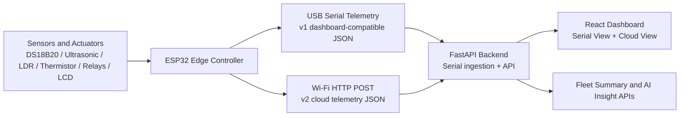

# Vehicle AI System

Agentic AI-driven fleet intelligence for multi-fuel vehicles, built around an ESP32 edge controller, a FastAPI telemetry bridge, and a React operations dashboard.

This project demonstrates how low-cost embedded hardware can support real-time fuel optimization, roadworthiness monitoring, climate-impact reporting, and fleet visibility for vehicles such as keke, taxis, minibuses, and company transport.

## Executive Summary

The system combines four ideas in one working prototype:

- **Edge intelligence:** the ESP32 reads sensors, makes immediate operating decisions, and continues working even if the network fails.
- **Operational visibility:** the backend exposes live telemetry for dashboards, serial monitoring, and downstream integrations.
- **Decision transparency:** every optimization action is paired with a human-readable explanation.
- **Climate positioning:** the UI surfaces estimated cost savings and CO2 reduction to support sustainability and net-zero narratives.

This makes the project suitable for:

- competition demos
- smart mobility pilots
- fleet monitoring research
- climate-tech presentations
- embedded AI and IoT portfolio work

## What The System Does

At runtime, the prototype:

1. Reads **temperature**, **fuel level proxy**, **ambient light**, and **thermistor** values from the vehicle hardware.
2. Estimates fuel level using the **ultrasonic sensor**.
3. Selects a fuel strategy such as **PETROL**, **LPG**, or **CNG**.
4. Activates relays and indicators based on safety and efficiency conditions.
5. Shows live values on a **16x2 LCD** mounted on the hardware.
6. Emits structured telemetry over **USB serial** for the Serial Dashboard.
7. Optionally posts structured telemetry over **Wi-Fi HTTP** for the Cloud Dashboard.
8. Exposes data to a React frontend for monitoring, demo storytelling, and fleet-level summaries.

## Why It Matters

Transport operators in emerging and mixed-fuel environments often face three recurring problems:

- limited visibility into vehicle health
- poor fuel switching discipline
- weak data for sustainability reporting

This platform addresses those gaps by making the vehicle observable, explainable, and remotely monitorable without depending on expensive onboard computers or always-on cloud logic.

## Core Capabilities

### 1. Real-Time Vehicle Monitoring

- Engine temperature tracking
- Fuel level estimation from ultrasonic distance
- Ambient light sensing
- Thermistor fallback sensing
- Relay state visibility
- LCD feedback on the device itself

### 2. Observe -> Decide -> Act -> Explain

The system is designed around an agentic control loop:

- **Observe:** ingest sensor values from the hardware layer
- **Decide:** select an operating mode using embedded decision logic
- **Act:** switch relays, update indicators, and surface state
- **Explain:** provide a readable reason for the current operating choice

### 3. Offline-First Safety

The prototype remains useful even when cloud connectivity is unavailable:

- the ESP32 continues reading sensors
- the LCD keeps updating
- relay logic remains active
- serial telemetry still works
- cloud upload failures do not stop local operation

### 4. Climate and Cost Signaling

The dashboard includes prototype estimates for:

- **cost saved**
- **CO2 reduction**
- **fleet-level operational efficiency**

These values are intended as **estimated demo metrics**, not audited field measurements.

### 5. Fleet Monitoring Readiness

Although a single ESP32 can run the full demo, the backend and cloud telemetry flow are structured around:

- `vehicle_id`
- fleet summary aggregation
- multi-vehicle cloud telemetry history
- status and fuel mode distribution

That makes the architecture presentable as more than a single-device prototype.

## System Architecture



## Architecture Roles

### Edge Layer: ESP32 Firmware

Location:
- [C:\projects\vehicle-ai-system\firmware\arduino\vehicle_system\vehicle_system.ino](C:\projects\vehicle-ai-system\firmware\arduino\vehicle_system\vehicle_system.ino)

Responsibilities:

- sensor ingestion
- local rule-based decision logic
- LCD updates
- relay control
- serial telemetry output
- cloud telemetry upload

Important characteristic:

- the vehicle continues functioning locally even if the backend or Wi-Fi is unavailable

### Backend Layer: FastAPI Bridge

Location:
- [C:\projects\vehicle-ai-system\backend\app\main.py](C:\projects\vehicle-ai-system\backend\app\main.py)

Responsibilities:

- serial ingestion from ESP32
- simulator ingestion for demos and fallback
- cloud telemetry ingestion via HTTP POST
- fleet summary API
- AI insight API
- dashboard-facing health and telemetry endpoints

### Frontend Layer: React Dashboard

Location:
- [C:\projects\vehicle-ai-system\frontend](C:\projects\vehicle-ai-system\frontend)

Responsibilities:

- Serial Dashboard for live ESP32/simulator telemetry
- Cloud Dashboard for fleet-style telemetry presentation
- source labeling (`ESP32`, `SIMULATOR`, `MOCK`)
- status visualization
- climate and cost metric presentation

## Repository Structure

```text
vehicle-ai-system/
|-- backend/                     FastAPI telemetry bridge and API
|-- docs/                        Architecture, demo, deployment, and design notes
|-- firmware/
|   |-- arduino/vehicle_system/  ESP32 Arduino firmware
|   `-- micropython/             Earlier MicroPython-oriented artifacts
|-- frontend/                    React + TypeScript dashboard
|-- START-DEMO-MODE.bat
|-- START-FULL-SYSTEM.bat
`-- README.md
```

## Hardware Components

The current firmware is built around:

- ESP32 development board
- DS18B20 temperature sensor
- HC-SR04 ultrasonic sensor
- LDR
- thermistor
- 2 relays
- LEDs
- buzzer
- 16x2 LCD

Pin mappings are defined in:
- [C:\projects\vehicle-ai-system\firmware\arduino\vehicle_system\config.h](C:\projects\vehicle-ai-system\firmware\arduino\vehicle_system\config.h)

## Telemetry Flows

### Serial Telemetry Path

Used by the Serial Dashboard:

```text
ESP32 -> USB Serial -> FastAPI /api/latest -> React Serial Dashboard
```

This path is ideal for:

- live bench demos
- judging sessions
- offline or local-only operation

### Cloud Telemetry Path

Used by the Cloud Dashboard:

```text
ESP32 -> Wi-Fi POST /api/telemetry -> FastAPI fleet store -> React Cloud Dashboard
```

This path is ideal for:

- fleet storytelling
- remote telemetry demos
- multi-vehicle expansion
- climate and summary views

## Example Telemetry

### Serial Dashboard Payload

```json
{
  "timestamp": "2026-04-30T18:49:24.917163Z",
  "engine_temperature": 31.19,
  "fuel_line_temperature": 31.19,
  "ambient_temperature": 28.19,
  "current_fuel_mode": "LPG",
  "ai_recommendation": "Low light - LPG efficiency mode",
  "relay_state_1": false,
  "relay_state_2": false,
  "overheat_flag": false,
  "system_status": "EFFICIENT",
  "network_status": "connected",
  "power_source": "usb"
}
```

### Cloud Dashboard Payload

```json
{
  "vehicle_id": "KKE-001",
  "vehicle_type": "keke",
  "temperature": 31.19,
  "distance_cm": 5.0,
  "fuel_percent": 100,
  "fuel_mode": "LPG",
  "status": "EFFICIENT",
  "relay1": "OFF",
  "relay2": "OFF",
  "ldr": 417,
  "thermistor": 1830,
  "cost_saved": 1.5,
  "co2_reduction": 1.0,
  "reason": "Low light - LPG efficiency mode",
  "timestamp_source": "device"
}
```

## API Overview

Key backend endpoints:

- `GET /api/health` - backend mode and ingestion health
- `GET /api/latest` - latest serial/simulator telemetry
- `GET /api/history` - recent serial/simulator telemetry history
- `POST /api/telemetry` - ingest cloud telemetry from ESP32
- `GET /api/telemetry/latest` - latest cloud telemetry
- `GET /api/telemetry/history` - cloud telemetry history
- `GET /api/fleet/summary` - fleet metrics and distributions
- `POST /api/ai-insight` - AI/fallback insight generation

Interactive docs are available from FastAPI when running locally:

- `http://localhost:8000/docs`
- `http://localhost:8000/redoc`

## Quick Start

### 1. Backend

```powershell
cd C:\projects\vehicle-ai-system\backend
python -m pip install -r requirements.txt
python -m uvicorn app.main:app --host 0.0.0.0 --port 8000
```

### 2. Frontend

```powershell
cd C:\projects\vehicle-ai-system\frontend
npm install
npm run build
npm run dev
```

Frontend environment variable:

- `VITE_API_URL` defaults to `http://localhost:8000/api`

## Running Modes

### Simulator Mode

Best for UI validation and backup demos.

```powershell
cd C:\projects\vehicle-ai-system\backend
$env:INGESTION_MODE="simulator"
python -m uvicorn app.main:app --host 0.0.0.0 --port 8000
```

### ESP32 Serial Mode

Best for live hardware demos where the dashboard must say `SOURCE: ESP32`.

```powershell
cd C:\projects\vehicle-ai-system\backend
$env:INGESTION_MODE="serial"
$env:SERIAL_PORT="COM6"
$env:SERIAL_BAUD_RATE="115200"
python -m uvicorn app.main:app --host 0.0.0.0 --port 8000
```

### Cloud Telemetry Mode

To feed the Cloud Dashboard from the ESP32 over Wi-Fi:

1. Update local values in `config.h` on your machine
2. Point `CLOUD_ENDPOINT` to your laptop IP and backend port
3. Make sure the backend is reachable on the local network
4. If needed, allow inbound TCP `8000` through Windows Firewall

Example local-only firmware configuration:

```cpp
#define WIFI_SSID       "YOUR_WIFI_SSID"
#define WIFI_PASSWORD   "YOUR_WIFI_PASSWORD"
#define CLOUD_ENDPOINT  "http://192.168.x.x:8000/api/telemetry"
```

Important:

- do not commit real Wi-Fi credentials
- do not commit your private LAN IP unless you explicitly want it public

## Demo Narrative

For competition use, the project is best presented as:

- **LCD:** proof of live edge intelligence on the vehicle
- **Serial Dashboard:** proof that real ESP32 telemetry reaches the software stack
- **Cloud Dashboard:** proof that the concept scales to fleet monitoring

That gives judges a clean progression:

```text
Hardware -> Telemetry -> Decision Logic -> Dashboard -> Fleet Insight
```

## AI Positioning

The system is deliberately structured to make the intelligence legible.

### What runs on the ESP32

- sensor observation
- local decision logic
- relay actions
- status reasoning

### What runs in the backend

- fleet ingestion
- API serving
- optional AI/fallback insight generation for presentation and advisory workflows

This separation is important for judging because it shows:

- safety-critical control remains local
- the cloud/backend layer augments visibility and advisory capabilities
- the architecture remains deployable in low-connectivity settings

## Climate and Impact Framing

The project should be presented as a **transport intelligence prototype**, not as a final certified measurement platform.

What is credible to say:

- the platform helps monitor fuel behavior and operating conditions
- it can encourage cleaner mode selection under defined rules
- it provides estimated cost and emissions indicators
- it creates the data foundation needed for future calibration and reporting

What should remain labeled as estimated:

- CO2 reduction
- cost savings
- any claims tied to real-world fleet-wide impact without field validation

## Professional Strengths Of The Project

- clear hardware-to-cloud story
- visible agentic loop
- practical embedded implementation
- strong demo potential
- professional UI surface
- multi-vehicle growth path
- climate relevance

## Known Constraints

- cloud ingestion on a local Wi-Fi network may require Windows Firewall adjustment
- cloud metrics are prototype estimates
- current backend storage is in-memory rather than database-backed
- production-grade authentication and persistence are not yet implemented

These are acceptable prototype limitations if they are explained clearly.

## Deployment Notes

### Frontend

The frontend is a Vite React app and can be deployed to a static host such as:

- Vercel
- Netlify

There is already a `netlify.toml` in:
- [C:\projects\vehicle-ai-system\frontend\netlify.toml](C:\projects\vehicle-ai-system\frontend\netlify.toml)

### Backend

The FastAPI backend is suitable for local hosting and can be adapted for:

- Render
- Railway
- VPS or local Windows/Linux machine

For deployed frontend/backend setups, ensure:

- `VITE_API_URL` points to the deployed backend
- CORS origins are configured correctly
- secrets remain in environment variables, not committed files

## Documentation

Useful supporting documents in this repository:

- [C:\projects\vehicle-ai-system\docs\architecture.md](C:\projects\vehicle-ai-system\docs\architecture.md)
- [C:\projects\vehicle-ai-system\docs\demo-script.md](C:\projects\vehicle-ai-system\docs\demo-script.md)
- [C:\projects\vehicle-ai-system\docs\DEPLOYMENT-CONFIG.md](C:\projects\vehicle-ai-system\docs\DEPLOYMENT-CONFIG.md)
- [C:\projects\vehicle-ai-system\docs\HARDWARE-INTEGRATION-SUMMARY.md](C:\projects\vehicle-ai-system\docs\HARDWARE-INTEGRATION-SUMMARY.md)
- [C:\projects\vehicle-ai-system\docs\frontend-spec.md](C:\projects\vehicle-ai-system\docs\frontend-spec.md)
- [C:\projects\vehicle-ai-system\docs\backend-spec.md](C:\projects\vehicle-ai-system\docs\backend-spec.md)

## Roadmap

High-value next steps:

- persist telemetry to a database
- support authenticated multi-tenant fleet views
- add richer AI advisory orchestration
- improve cloud-ingest reliability across local networks
- add screenshots and demo media directly to this README
- add deployment walkthroughs for Render and Vercel

## License And Usage

No explicit license file is currently included in the repository. If this project will be shared publicly beyond demo use, adding a license is recommended.

## Credits

Developed as an embedded AI and smart transport prototype for competition-style demonstration, sustainability storytelling, and practical fleet intelligence exploration.
